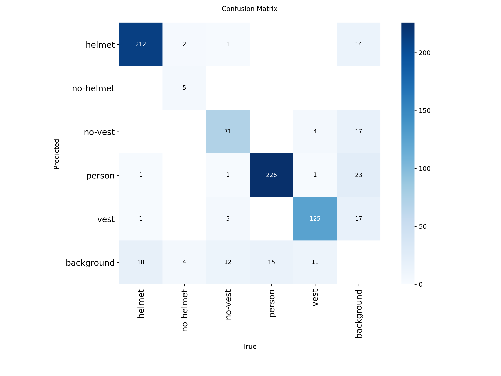
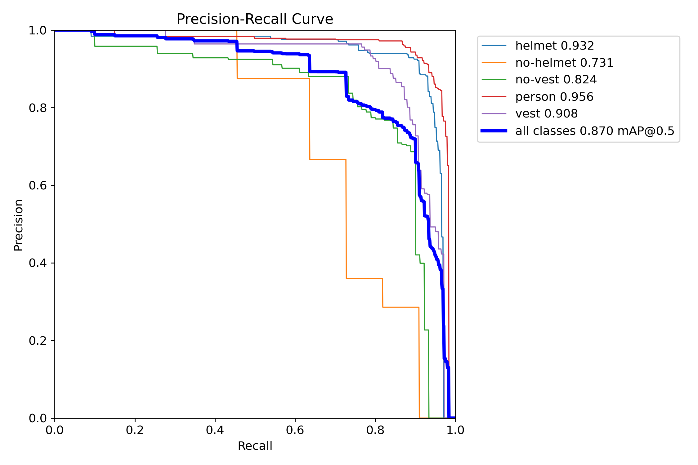
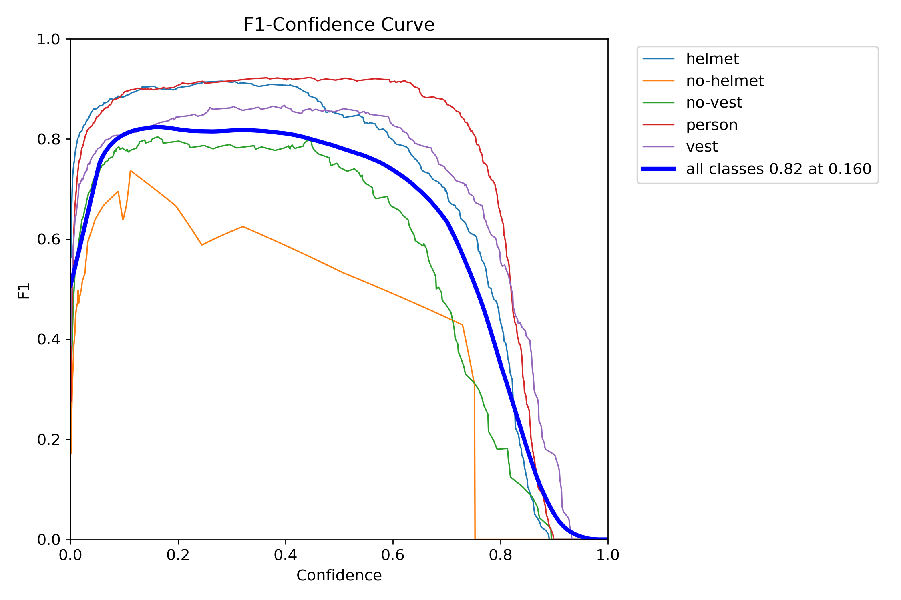
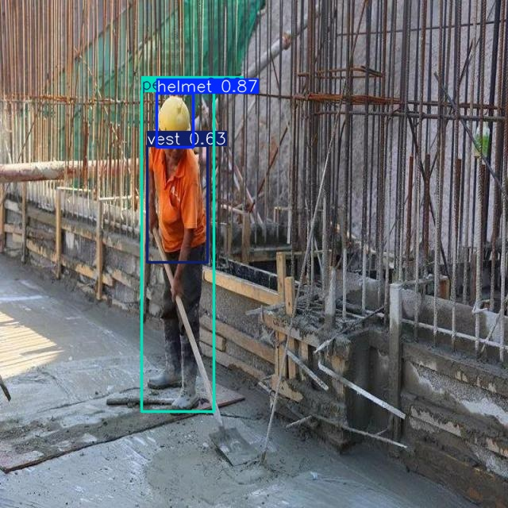
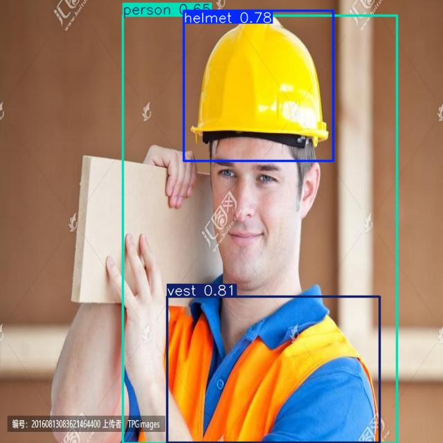
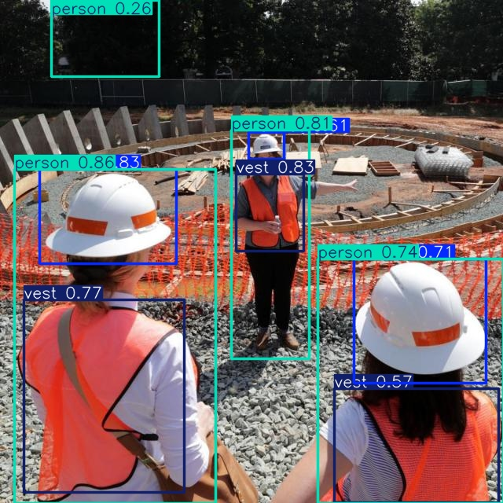
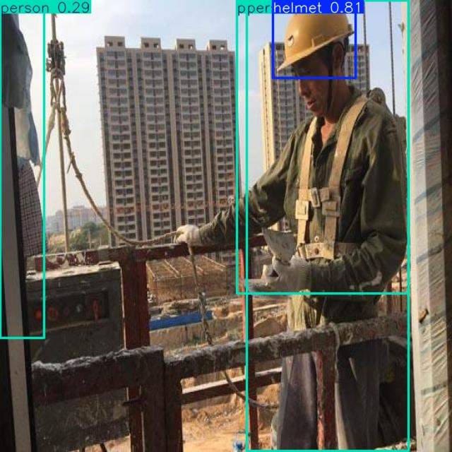

# Model Evaluation & Analysis: Construction Safety (RF100)

## 1. Metrics Comparison

Both YOLOv8n (nano) and YOLOv8s (small) were trained for 100 epochs on a Tesla T4 GPU using the Roboflow 100 Construction Safety dataset. Below is the final epoch validation comparison:

| Metric          | YOLOv8n | YOLOv8s |
| :-------------- | :------ | :------ |
| **Precision** | 0.830   | 0.849   |
| **Recall** | 0.837   | 0.741   |
| **mAP50** | 0.870   | 0.867   |
| **mAP50-95** | 0.487   | 0.491   |
| **Inference Speed**| 2.8 ms  | 5.0 ms  |
| **Model Size** | 6.3 MB  | 22.5 MB |

**Model Selection:** **YOLOv8n** was selected for final ONNX export and deployment. While YOLOv8s holds a marginal lead in Precision and mAP50-95, YOLOv8n demonstrates a roughly 10% improvement in Recall. In safety monitoring pipelines, minimizing false negatives (missing a safety violation) is prioritized over false positives. Additionally, YOLOv8n is roughly 4x smaller and executes nearly twice as fast, making it highly optimal for local CPU deployment.

---

## 2. Visual Performance Metrics

The following metrics represent the chosen **YOLOv8n** model evaluated on the validation split.

### Confusion Matrix

### Precision-Recall (PR) Curve

### F1 Confidence Curve

---

## 3. Qualitative Analysis

### Sample Predictions
Under standard lighting and clear line-of-sight conditions, the model demonstrates robust capability. It successfully draws distinct bounding boxes for `person`, `helmet`, and `vest` even when multiple workers are clustered together in the frame.

**Successful Detection Example 1:**

**Successful Detection Example 2:**

### Failure Cases & Analysis

**False Positives Analysis:**
* **Observation:** The model occasionally predicts the `person` class on dark, human-shaped shadows cast onto the ground or walls by structures or actual workers. 
* **Impact:** This leads to inflated worker counts and could trigger unnecessary monitoring alerts in empty areas of the site.
* **Future Mitigation:** Enhance the dataset with images taken at varying times of day (different sun angles) and utilize "hard-negative mining" by adding empty background images containing heavy shadows to force the model to learn structural depth.

**False Negatives Analysis :**
* **Observation:** The model struggles to detect `no-helmet` and `no-vest` instances when a worker is heavily occluded by scaffolding, machinery, or located deep in the background.
* **Impact:** This is a critical failure case, as undetected PPE violations pose a severe compliance and physical safety risk.
